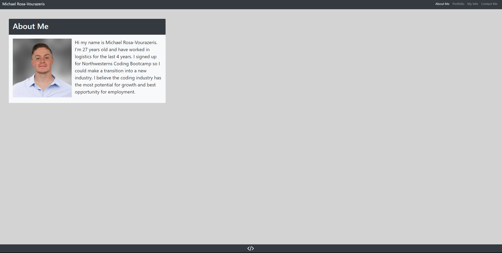
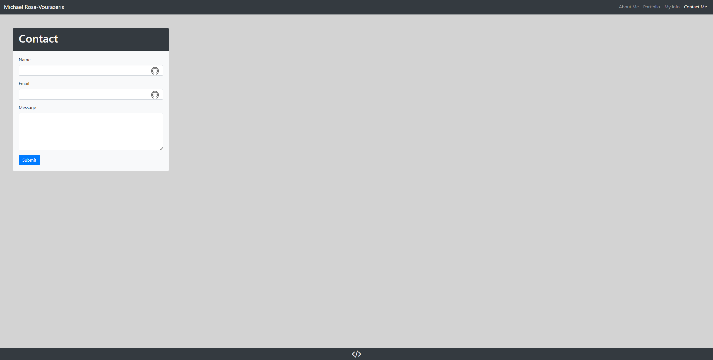

# Responsive Portfolio

## Description

This repository contains my completed work for homework week 2. In this week's homework, we were to build a responsive portfolio site using Bootstrap components and grid system. This portfolio site was supposed to be similar, but not identical, to the screen shots provided in this week's homework folder. I built a similar portfolio site, but added my own touch of style to it. This repository contains that portfolio site.

## Screen Shot of Completed Work

## Link to Deployed Application

https://mrosavourazeris.github.io/index.html